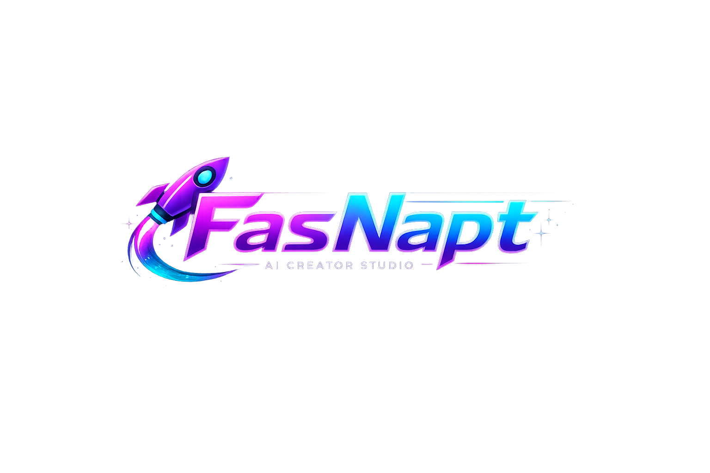

# 🚀 FasNapt AI Creator Studio
Created by FARHEEN TAJ
<div align="center">



FasNapt Screenshort


### 🌟 AI-Powered Creator Platform for the Next Generation of Content Creators

**Create • Edit • Analyze • Grow • Scale**


</div>

---

# 📌 Overview

FasNapt AI Creator Studio is a full-stack creator ecosystem that combines AI-powered content tools, analytics, video management, real-time communication, cloud storage, and creator growth systems into a single platform.

The project was designed to solve a common problem faced by creators: managing multiple tools for content planning, editing, analytics, audience engagement, and performance tracking.

FasNapt centralizes these capabilities into one modern, scalable application.

---

# 🎯 Problem Statement

Content creators often switch between multiple platforms to:

* Generate captions
* Create hashtags
* Track analytics
* Manage projects
* Store media
* Communicate with audiences
* Monitor growth

This results in fragmented workflows and reduced productivity.

FasNapt provides a unified AI-powered solution.

---

# ✨ Core Features

## 🤖 AI Creator Hub

* AI Caption Generator
* AI Hashtag Generator
* Viral Score Calculator
* Content Idea Generator
* Daily Creator Tips
* Content Planning System
* Achievement Tracking

---

## 🎬 Creator Studio

* Video Upload
* Video Management
* Project Creation
* Media Organization
* Cloud Storage Integration

---

## 📊 Analytics Dashboard

* Engagement Analytics
* Audience Growth Tracking
* Performance Monitoring
* Weekly Reports
* Downloadable Reports
* Achievement Progress Tracking

---

## 👤 Creator Profile

* Profile Customization
* Portfolio Showcase
* Achievement Badges
* Social Media Links
* Project Display

---

## 💬 Real-Time Communication

* Socket.io Chat System
* Live Messaging
* Instant Notifications

---

## 🔐 Authentication & Security

* User Registration
* Secure Login
* Password Hashing
* JWT Authentication
* Protected Routes

---

## ☁️ Cloud Integration

* Cloudinary Media Storage
* MongoDB Database
* REST APIs
* Scalable Architecture

---

# 🏗️ Software Architecture

```text
FasNapt AI Creator Studio

Frontend
│
├── Landing Page
├── Authentication
├── Dashboard
├── Creator Studio
├── AI Creator Hub
├── Analytics
├── Profile
├── Chat System
└── Admin Panel

Backend
│
├── Authentication API
├── Project API
├── Video API
├── Analytics API
├── Notification API
├── Follow System API
└── Admin API

Database
│
├── Users
├── Projects
├── Videos
├── Followers
├── Likes
├── Comments
└── Notifications

Cloud Services
│
├── Cloudinary
├── MongoDB Atlas
├── Render
└── Vercel
```

---

# 🛠 Technology Stack

## Frontend

* HTML5
* CSS3
* JavaScript (ES6)

## Backend

* Node.js
* Express.js

## Database

* MongoDB
* Mongoose

## Authentication

* JWT
* bcrypt.js

## Real-Time Communication

* Socket.io

## Cloud Services

* Cloudinary

## Deployment

* Docker
* GitHub Actions
* Vercel
* Render

---

# 📱 Responsive Design

Fully optimized for:

✅ Mobile Phones

✅ Tablets

✅ Laptops

✅ Desktop Screens

---

# 🔥 Key Technical Highlights

### Full Stack Development

Implemented both frontend and backend architecture using modern web technologies.

### Real-Time Communication

Built a Socket.io-powered chat system for instant messaging and notifications.

### Secure Authentication

Implemented JWT authentication and password hashing using bcrypt.js.

### Cloud Media Storage

Integrated Cloudinary for scalable video and image management.

### Analytics Engine

Developed a creator analytics dashboard with growth tracking and performance insights.

### Scalable Database Design

Designed MongoDB schemas for users, projects, videos, comments, followers, and notifications.

### Progressive Web Application

Added PWA capabilities for enhanced mobile experience and offline support.

---

# 📸 Project Screenshots

```text
screenshots/

home.png
dashboard.png
analytics.png
profile.png
chat.png
video-editor.png
```

Add your screenshots here after deployment.

---

# 🚀 Installation

## Clone Repository

```bash
git clone https://github.com/yourusername/FasNapt-AI-Creator-Studio.git
```

## Navigate

```bash
cd FasNapt-AI-Creator-Studio
```

## Backend Setup

```bash
cd backend

npm install

npm run dev
```

## Environment Variables

```env
PORT=5000

MONGO_URI=your_mongodb_uri

JWT_SECRET=your_jwt_secret

CLOUD_NAME=your_cloud_name

CLOUD_API_KEY=your_cloud_api_key

CLOUD_API_SECRET=your_cloud_api_secret
```

---

# 📈 Future Enhancements

* AI Recommendation Engine
* AI Video Editing
* Creator Marketplace
* Mobile Application
* Team Collaboration
* Monetization Features
* Multi-Language Support
* AI-Powered Feed Ranking

---

# 🎓 Skills Demonstrated

This project demonstrates proficiency in:

* Frontend Development
* Backend Development
* Database Design
* REST API Development
* Authentication Systems
* Cloud Integration
* Real-Time Applications
* Software Architecture
* Responsive Design
* DevOps Fundamentals
* Deployment Pipelines
* Full Stack Engineering

---

# 💡 What I Learned

During the development of FasNapt, I gained hands-on experience with:

* Building scalable full-stack applications
* Designing RESTful APIs
* Managing cloud-based media storage
* Implementing secure authentication
* Creating responsive user interfaces
* Working with real-time communication systems
* Structuring production-ready projects

---

# 👩‍💻 Developer

## Farheen Taj

B.Sc Computer Science Student

Interested in:

* Software Engineering
* Full Stack Development
* Artificial Intelligence
* Cloud Computing
* Product Development

---

# 🌟 Why Recruiters Should Look At This Project

FasNapt demonstrates:

✅ Full Stack Development

✅ Authentication & Security

✅ Database Design

✅ Cloud Integration

✅ Real-Time Features

✅ Analytics Systems

✅ Modern UI/UX

✅ Scalable Architecture

✅ Deployment Knowledge

✅ Software Engineering Best Practices

This project showcases the ability to design, build, deploy, and scale a modern web application from scratch.

---

# ⭐ Support

If you found this project useful:

⭐ Star the repository

🍴 Fork the project

🚀 Share feedback

---

<div align="center">

### 🚀 Building the Future of Creator Technology

**Made with passion by Farheen Taj**

</div>

---

# 🏆 Recommended Final Git Commit

```bash
git add .

git commit -m "🚀 Launch FasNapt AI Creator Studio: Full-Stack AI-Powered Creator Platform featuring Authentication, Analytics, Real-Time Chat, Cloud Storage, Video Management, AI Tools, PWA Support, Docker Deployment, and Scalable Software Architecture"

git push origin main
```

### GitHub Repository Description

```text
FasNapt AI Creator Studio is a full-stack AI-powered creator platform featuring analytics dashboards, real-time communication, secure authentication, cloud storage, video management, and scalable architecture built with JavaScript, Node.js, MongoDB, and Socket.io.
```

### GitHub Topics

```text
full-stack
software-engineering
javascript
nodejs
mongodb
express
socketio
cloudinary
ai
analytics-dashboard
creator-platform
video-editor
real-time-chat
portfolio-project
web-development
pwa
docker
```

